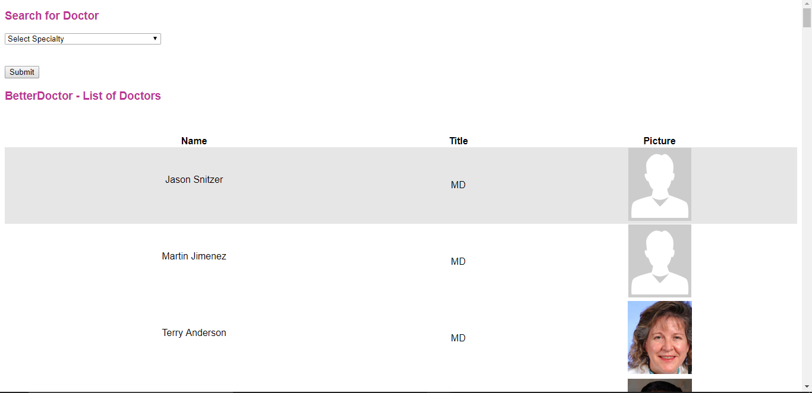
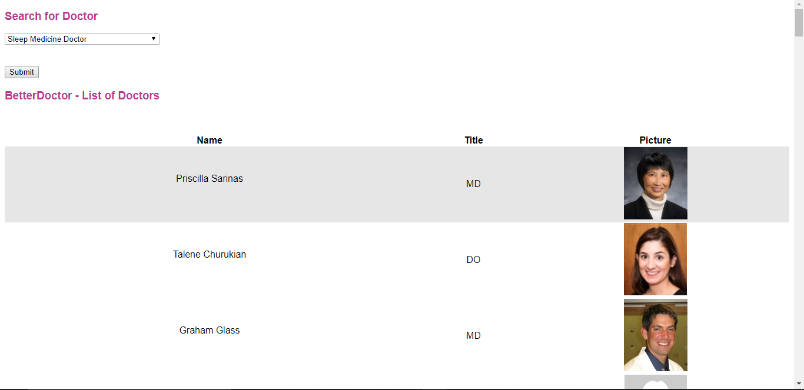
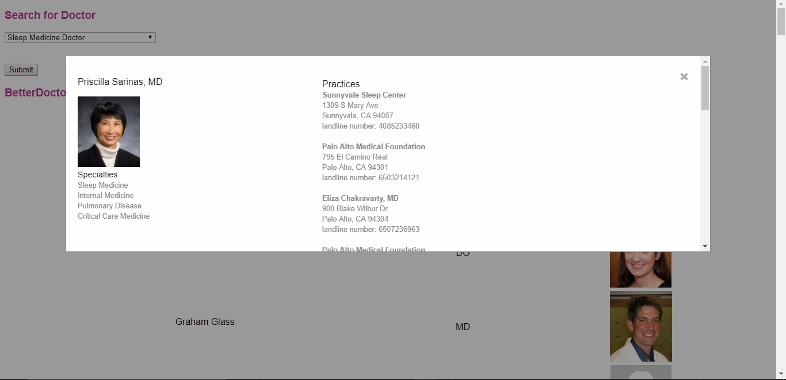
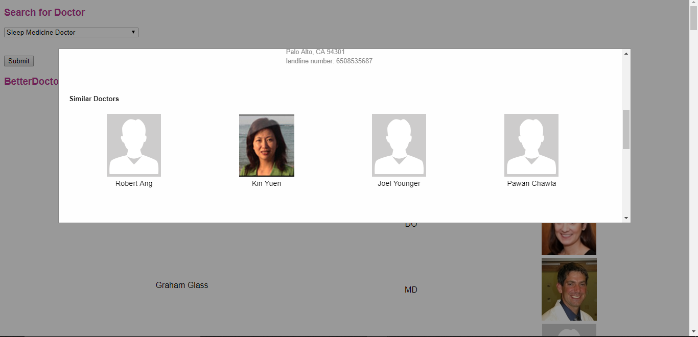

# betterdoctors

API used: BetterDoctor https://betterdoctor.com/partners/ 
Main library used: jquery 
This is a web application that allows users to browse through a preconfigured or filtered (by specialty) list of doctors. 
Upon selecting a doctor, more information on the doctor, along with a list of similar doctors, is provided. 
The "similarity" is determined by the doctors' specialties and practices. 
The similar doctors are sorted using 'best match' algoritm provided by the betterdoctors API 
 
Assumptions made: 
assumes user wants doctors located at 37.773,-122.413 
 
Hours spent thus far: 4 
 
Future Improvements:  
Performance: I believe the over-usage of jquery is the reason for the poor performance. 
&nbsp;&nbsp;Due to poor performance, need to wait a little bit before selecting a doctor for similar doctors list to be rendered 
Give users the option to select on similar doctors. 
&nbsp;&nbsp;Add another modal popup when users select similar doctors 
Visuals: Add background image, change the look of buttons and drop down menu, add more animations and visual appeal 
Remove location assumption by asking users for their location 
 
Screenshots: 
 
When the page is loaded 
 
 
When user filters by specific specialty 
 
 
When user selects doctor 
 
 
List of similar doctors in modal 
